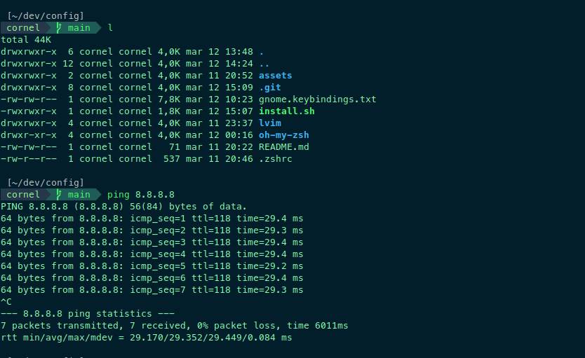
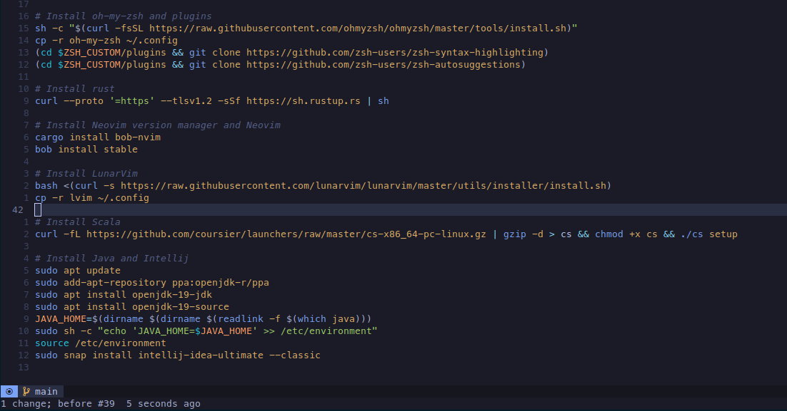

# Environment Configuration

This repository contains configuration files for various tools used in a development environment, including editors, terminals, and shell environments.

These configuration files can be used to set up a consistent and efficient development environment across multiple machines.






---

## Getting Started

### Prerequisite

1. There should Nerd Fonts installed for an optimal experience [Install](https://www.nerdfonts.com/).

### Installation

1.  Clone this repository

```bash
git clone https://github.com/corneliu-rotari/config.git
cd config
```

2. Run the install script

```bash
./install.sh
```

---

## Contributing

If you have a configuration file that you think would be useful to others, feel free to submit a pull request to add it to this repository.

Similarly, if you notice any issues with the existing configuration files, please submit a pull request with the fix.
